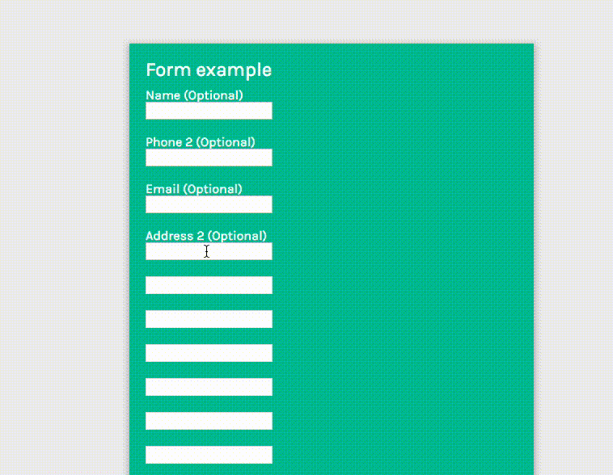
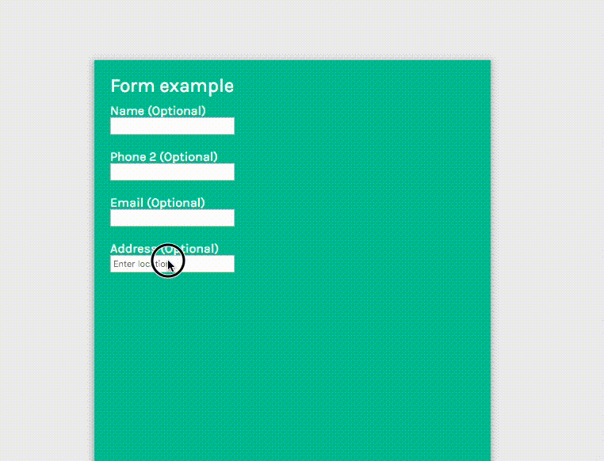

This module adds a Google-based input field validating addresses. It is meant for use alongside the `apostrophe-forms` module.

When using it, you must configure the `formWidgets` option to `apostrophe-forms` to include it, as well as all other form widgets you wish to use. See the `apostrophe-forms` documentation.

## Configuration

```javascript
// in app.js
modules: {
  'apostrophe-forms': {
    formWidgets: {
      // other fields go here
      'apostrophe-forms-google-address-field': {}
    }
  },
  'apostrophe-forms-widgets': {},
  'apostrophe-forms-google-address-field-widgets': {
    googleApiKey: 'validGoogleApiKeyHere' // mandatory
  }
}
```

The user will need a valid Google API key for the suggestions displayed by Google to work as stated in Google Maps Platform documentation: [https://developers.google.com/maps/documentation/javascript/places-autocomplete](https://developers.google.com/maps/documentation/javascript/places-autocomplete). You must connect a billing account to the Google API console project.

## Advanced settings

By default, the response from Google will be split into 3 fields: street address, route and city. If you don't need this, you can uncheck the boxes in "Advanced settings / Split Address".

Split address demo:



Basic demo:



Other settings can restrict the number of results
- to a type (addresses, regions, establishments, ...)
- to a certain area with coordinates
- to countries (5 at max due to Google policy)
