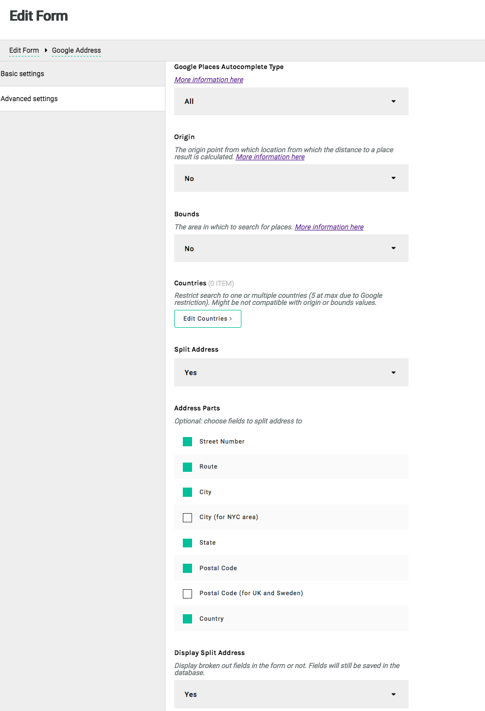

This module adds a Google-based input field validating addresses. It is meant for use alongside the `apostrophe-forms` module.

When using it, you must configure the `formWidgets` option to `apostrophe-forms` to include it, as well as all other form widgets you wish to use. See the `apostrophe-forms` documentation.

## Configuration

```javascript
// in app.js
modules: {
  'apostrophe-forms': {
    formWidgets: {
      // other fields go here
      'apostrophe-forms-google-address-field': {}
    }
  },
  'apostrophe-forms-widgets': {},
  'apostrophe-forms-google-address-field-widgets': {
    googleApiKey: 'validGoogleApiKeyHere' // mandatory
  }
}
```

The user will need a valid Google API key for the suggestions displayed by Google to work as stated in Google Maps Platform documentation: [https://developers.google.com/maps/documentation/javascript/places-autocomplete](https://developers.google.com/maps/documentation/javascript/places-autocomplete). You must connect a billing account to the Google API console project.

Default rendering:


When submitted, the form's output will contain the input's name and value.
For example, if the input's name is `address`, the above example would output:

```js
{
  address: 'Tour Eiffel, Avenue Anatole France, Paris, France'
}
```


## Advanced settings

The number of results can be restricted
- to a type (addresses, regions, establishments, ...)
- to a certain area with coordinates
- to countries (5 at max due to Google policy)

The address can also be split into multiple fields, as allowed by Google. The current list of choices is the following:

```js
{
  value: 'street_number',
  label: 'Street Number'
},
{
  value: 'route',
  label: 'Route'
},
{
  value: 'locality',
  label: 'City'
},
{
  value: 'sublocality_level_1',
  label: 'City (for NYC area)'
},
{
  value: 'administrative_area_level_1',
  label: 'State'
},
{
  value: 'postal_code',
  label: 'Postal Code'
},
{
  value: 'postal_town',
  label: 'Postal Code (for UK and Sweden)'
},
{
  value: 'country',
  label: 'Country'
}
```

Broken out fields are displayed by default. They can be hidden through the option "Show Split Address".

Example of a configuration:



Rendering example of the above configuration:


### Output

When submitted, the form's output will contain the field name followed by the broken out fields names and values.
For example, if the field name is `address`; the above example would output:

```js
{
  address: 'Tour Eiffel, Avenue Anatole France, Paris, France',
  'address-street_number': '5',
  'address-route': 'Avenue Anatole France',
  'address-locality': 'Paris',
  'address-postal_code': '75007',
  'address-administrative_area_level_1': 'Île-de-France',
  'address-country': 'France'
}
```

This is what is saved in the database. The object keys come from the package configuration and are the same as Google.

### Using multiple Google-based input fields on the same page

It is possible to use multiple Google-based input fields on the same page. Just be sure the names are different. The output will adapt.

For example, if there are 2 fields (one standard named `address`, the other one in "split" mode named `address-2`), here is a possible output:

```js
{
  address: 'Tour Eiffel, Avenue Anatole France, Paris, France',
  'address-2': 'Rue de Rivoli, Paris, France',
  'address-2-route': 'Rue de Rivoli',
  'address-2-locality': 'Paris',
  'address-2-administrative_area_level_1': 'Île-de-France',
  'address-2-country': 'France'
}
```

### Labels

In "split" mode, if the broken out fields are displayed, labels will be added to the form. They will contain technical values (`street_number`, `administrative_area_level_1`, ...).

In order to display them differently, edit the JSON files in the folder containing the i18n translations (`locales` at the project level by default).

Example in a `en.json` file

```json
"street_number": "Street Number",
"route": "Route",
"locality": "City",
"administrative_area_level_1": "State",
"postal_code": "Postal Code",
"country": "Country"
```

